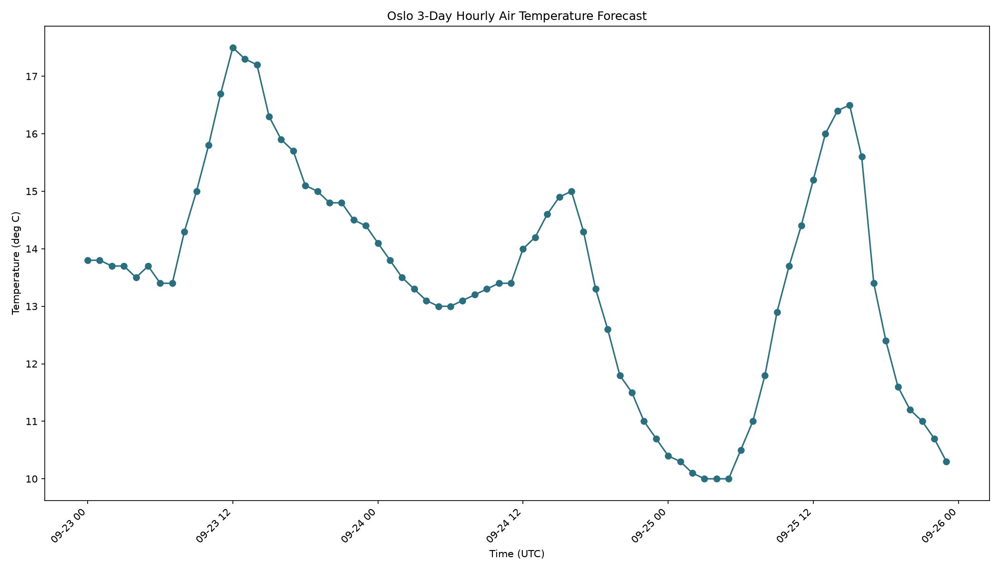

# The phenomenon

<!-- This is the SD5913 assignment 2 template. Everything in this file is yours to
replace, and the check counts words: comments like this one are not words, so
delete each one as you write. Start with the heading: name the phenomenon.

Then, in this order, at least 150 words in total.

New to folders, paths, or the files here whose names start with a dot? Read
https://github.com/sd5913/pfad/blob/2026/reference/files.md first. Ten minutes. -->



## The phenomenon

<!-- What goes up and down, and why you looked at it. -->
This chart shows the diurnal temperature cycle in Oslo, Norway over the next three days. It clearly shows that temperatures drop significantly at night and rise during the day, forming a periodic peak-valley cycle. This regular fluctuation comes from solar radiation: temperatures fall without sunlight at night and warm up gradually after sunrise with solar heating.

## The source

<!-- A link to the page or endpoint the file came from, and one line on what is in
the file: how many rows, what a row means, what the units are. -->
Data is fetched from the Open-Meteo API endpoint:https://open-meteo.com/en/docs/metno-api#data_sources.

The dataset contains 72 hourly records of 2-metre air temperature in degrees Celsius for Oslo (59.91, 10.75). Each row represents one hour of forecast time.

## What the picture shows

<!-- Two or three sentences. Including what it hides: every transformation throws
something away, and naming what yours threw away is the easiest way to sound like
you know what you did. -->
The line chart visualises continuous hourly temperature changes in UTC time, with temperatures ranging from 10°C to 17.5°C. While it captures the daily temperature rhythm, this chart discards other related meteorological variables such as wind speed, cloud cover and precipitation. It only presents temperature values and cannot explain the reasons behind temperature fluctuations.

## Run it

```
uv run fetch.py
uv run plot.py
```
